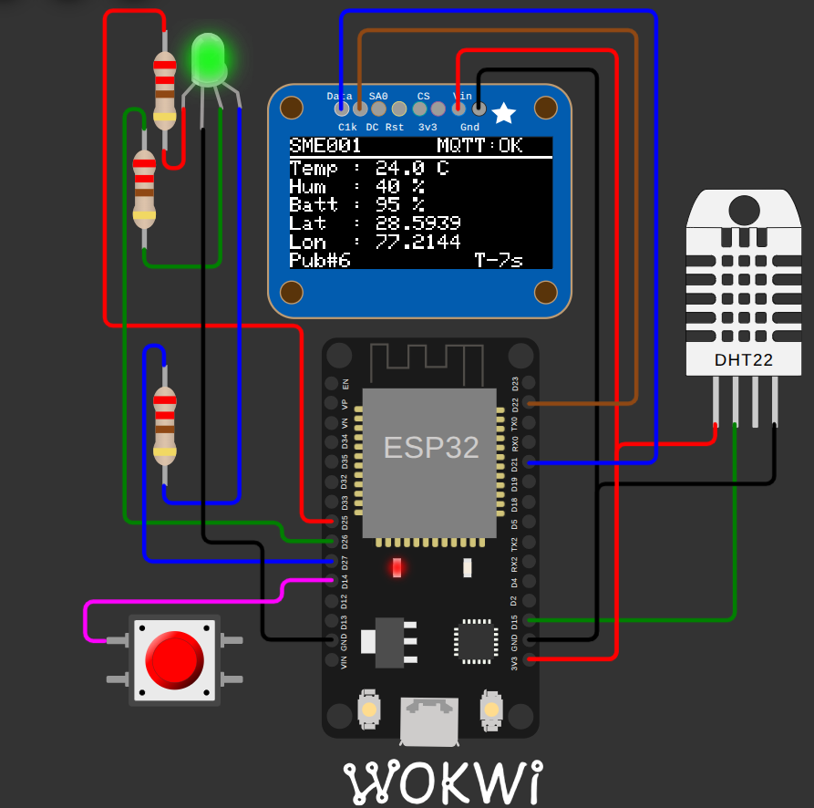

<div align="center">

# IoT Device Simulator

### ESP32 IoT Device Simulator for Smart Supply Chain Telemetry

<p>
  
  
  
  
  
</p>
<br/>

</div>

<p>
  ESP32-based IoT edge simulator that reads environmental data,
  tracks GPS movement and battery health, and streams real-time telemetry
  through MQTT every 10 seconds.
</p>

<p>
  <strong>DHT22</strong> •
  <strong>MQTT</strong> •
  <strong>OLED Dashboard</strong> •
  <strong>ESP32</strong> •
  <strong>Wokwi</strong>
</p>

</div>

---

## 📖 Overview

This Project simulates a real-world logistics and supply-chain tracking device running on an ESP32.

The system periodically:

* Reads temperature and humidity from a DHT22 sensor
* Simulates GPS movement around New Delhi
* Tracks battery depletion
* Publishes telemetry to an MQTT broker
* Displays device status on an OLED screen
* Provides visual connection feedback using an RGB LED

This project demonstrates key concepts used in modern IoT systems including telemetry pipelines, edge-device monitoring, MQTT communication, sensor integration, and embedded dashboards.

---

## ✨ Features

### 🌡 Environmental Monitoring

* Real-time temperature sensing
* Humidity monitoring
* Fault-tolerant sensor reads

### 📍 GPS Simulation

* Random-walk location movement
* Delhi-area bounded coordinates
* Realistic telemetry updates

### 🔋 Battery Modeling

* Simulated power consumption
* Gradual battery depletion
* Long-duration device operation testing

### 📡 MQTT Communication

* JSON payload publishing
* Automatic reconnection
* Retained messages support

### 🖥 User Interface

* SSD1306 OLED dashboard
* RGB connection indicators
* Push-button instant publish

---

## 🏗 System Architecture

```text
                ┌─────────────┐
                │   DHT22     │
                └──────┬──────┘
                       │
                       ▼
┌─────────────────────────────────────┐
│               ESP32                 │
│          SupplyMesh Edge            │
└───────┬─────────────┬───────────────┘
        │             │
        ▼             ▼
   OLED Display    RGB Status LED
        │
        ▼
   MQTT Publisher
        │
        ▼
 broker.hivemq.com
        │
        ▼
 MQTT Subscribers
```

---

## 📊 Sample Telemetry

```json
{
  "device_id": "SME001",
  "temperature": 25.4,
  "humidity": 72,
  "battery": 94,
  "latitude": 28.6134,
  "longitude": 77.1998
}
```

---

## 🖥 OLED Dashboard

```text
SME001              MQTT:OK
---------------------------
Temp : 25.4 C
Hum  : 72 %
Batt : 94 %
Lat  : 28.6134
Lon  : 77.1998
Pub#3               T-7s
```

---

## 🔧 Hardware Components

| Component         | Wokwi ID         | GPIO             |
| ----------------- | ---------------- | ---------------- |
| ESP32 DevKit V1   | `esp32`          | —                |
| DHT22             | `dht1`           | 15               |
| SSD1306 OLED      | `oled1`          | SDA=21, SCL=22   |
| RGB LED           | `rgb1`           | R=25, G=26, B=27 |
| Push Button       | `btn1`           | 14               |
| 220Ω Resistors ×3 | `r1`, `r2`, `r3` | —                |

---

## 🎨 RGB LED Status

| Colour        | Meaning                  |
| ------------- | ------------------------ |
| 🟡 Yellow     | Connecting to WiFi       |
| 🔵 Blue       | Connecting to MQTT       |
| 🟢 Green      | Connected and publishing |
| 🔴 Red        | Connection error         |
| ⚪ White Flash | Successful publish       |

---

## 🚀 Quick Start

### 1. Open Wokwi

Create a new ESP32 project at:

https://wokwi.com

### 2. Replace Project Files

Copy the following files from this repository:

```text
diagram.json
sketch.ino
libraries.txt
```

### 3. Start Simulation

Click:

```text
▶ Start Simulation
```

The device will:

```text
Connect WiFi
    ↓
Connect MQTT
    ↓
Publish First Reading
    ↓
Publish Every 10 Seconds
```

---

## 📡 MQTT Configuration

| Parameter      | Value                       |
| -------------- | --------------------------- |
| Broker         | broker.hivemq.com           |
| TCP Port       | 1883                        |
| WebSocket Port | 8000                        |
| Topic          | supplymesh/SME001/telemetry |
| Client ID      | SME001-ESP32                |
| Retain         | true                        |

---

## 🔍 Monitoring MQTT

Open HiveMQ WebSocket Client:

http://www.hivemq.com/demos/websocket-client/

Use:

```text
Host : broker.hivemq.com
Port : 8000
```

Subscribe to:

```text
supplymesh/SME001/telemetry
```

---

## 📚 Libraries Used

| Library            | Purpose              |
| ------------------ | -------------------- |
| PubSubClient       | MQTT communication   |
| ArduinoJson        | JSON serialization   |
| DHT Sensor Library | DHT22 interface      |
| Adafruit SSD1306   | OLED driver          |
| Adafruit GFX       | Graphics rendering   |
| Adafruit BusIO     | Hardware abstraction |

> `WiFi.h` is included with the ESP32 Arduino Core.

---

## ⚙️ Internal Workflow

```text
Boot
├── Connect WiFi
├── Connect MQTT
└── Publish Telemetry

Loop
├── Read DHT22
├── Simulate GPS
├── Drain Battery
├── Build JSON Payload
├── Publish MQTT Message
├── Flash RGB LED
└── Update OLED
```

### GPS Simulation

* Initial Position: `28.61, 77.20`
* Movement: ±0.01° per cycle
* Restricted within New Delhi boundary

### Battery Simulation

* Starts at `95%`
* Decreases by `0.05%`
* Reaches `0%` after approximately `1900` publish cycles

### Sensor Fault Handling

If a DHT22 read fails:

```text
Use Last Valid Reading
        ↓
Continue Publishing
```

This prevents telemetry interruptions.

---

## 📂 Project Structure

```text
esp32-iot-simulator/
├── sketch.ino
├── diagram.json
├── libraries.txt
├── README.md
└── docs/
    └── technical_explanation.docx
```

---

## 🔮 Future Improvements

* Secure MQTT over TLS
* Cloud dashboard integration
* Multiple device simulation
* Historical data visualization
* OTA firmware updates
* Sensor expansion support

---


<div align="center">

⭐ If you found this project useful, consider starring the repository.

</div>
